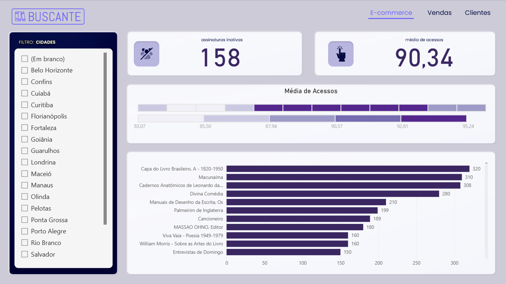
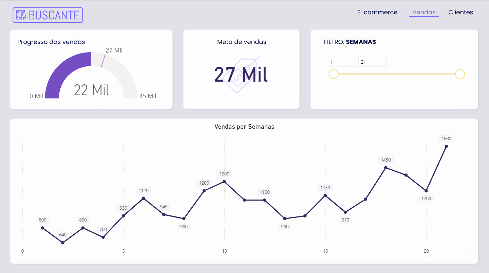
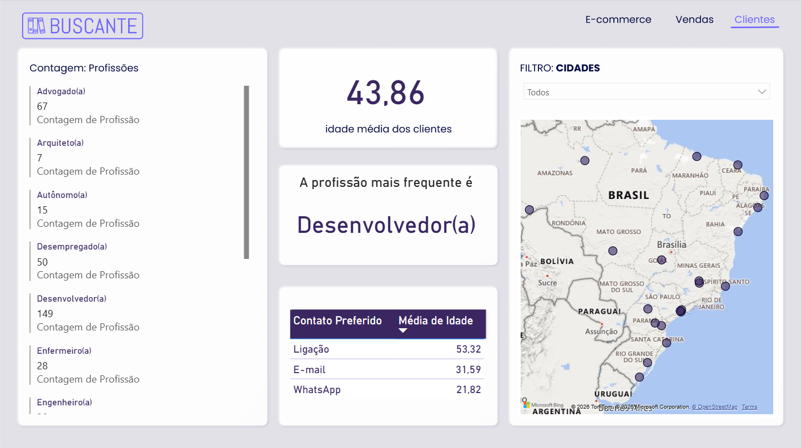

# 📊 Dashboard de Análise de E-commerce

Projeto de análise de dados desenvolvido em **Power BI**, com foco em
comportamento de usuários, desempenho de vendas e perfil de clientes.

---

## 🎯 Objetivo
Apoiar decisões estratégicas por meio da análise de indicadores-chave
relacionados a e-commerce, vendas e clientes.

---

## 📈 Principais KPIs
- Assinaturas inativas
- Média de acessos
- Progresso de vendas vs meta
- Vendas semanais
- Idade média dos clientes
- Profissão mais frequente

---

## 🧠 Insights Obtidos
- Identificação de padrões de acesso aos produtos
- Evolução positiva das vendas ao longo das semanas
- Predominância de clientes da área de tecnologia
- Preferência de canais de contato varia conforme a idade

---

## 🛠️ Ferramentas Utilizadas
- Power BI
- Modelagem de dados
- Visualização de dados
- Análise exploratória

---

## 📷 Visualizações do Dashboard

### E-commerce

### Vendas

### Clientes

